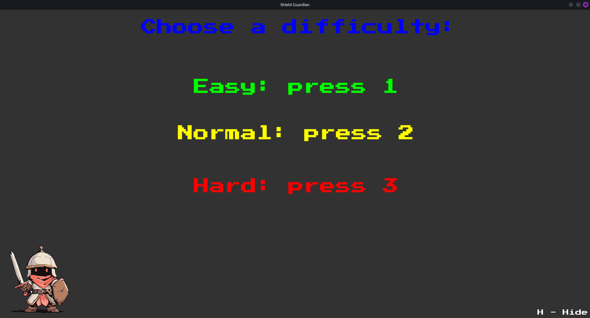
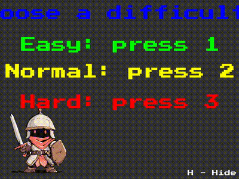

# Shield Guardian


## Table of Contents

1. [Overview](#1-overview)
2. [What the game looks like](#2-what-the-game-looks-like)
3. [How to Play](#3-how-to-play)
4. [How to Run](#4-how-to-run) 
5. [Future Plans](#5-future-plans)


## 1. Overview 

Knight of Solitude is a game programmed in C++ with the utilization of SFML. Main goal of the game is to stay alive as long as possible by avoiding cannonballs and laser beams.


## 2. What the game looks like

* After successfully running the program the menu window will appear that allows user to choose the difficulty of the game by pressing the corresponding key on thekeyboard:



After choosing a difficulty, there will be a 3 second countdown and the game will start. To avoid cannonballs, shield yourself by using "wasd" or arrow keys. On the other hand, to avoid laser beams, hide yourself by pressing H key. Visual representation below:





To play once more, press R key after current game ends. Unfortunately that way there will be no score update (it only adds up to score.txt file when fully running the game again).

## 3. How to Play

Shield yourself from cannon balls by moving the shield using "wasd" or arrow keys and hide yourself from laser beams by changing the color of the knight. To avoid laser beam user has to have the same color as the knight to successfully hide yourself. 


## 4. How to Run 

### On Linux

1. First, you have to clone this repository and go into it:

```
git clone https://github.com/Gab071/Shield_Guardian.git
cd Shield_Guardian
```

2. Install SFML, CMake, and build tools (if not already installed):
```
sudo apt install libsfml-dev cmake build-essential
```


3. Then build the project (in the Snake folder you just cloned):
```
cmake -B build
cmake --build build
```

4. Run the game (must be run from inside the build directory for assets to load properly):
```
cd build
./Shield_Guardian
```

Note: Step 4 is done this way because of the relative assets path (like *PressStart2P-Regular.ttf*)

Note: If in the future, there will be updates to this game (future plans will come true) it is needed to clear the old cache with a command:
```
rm -rf build
```

and repeat step 3. 


## 5. Future Plans

* Fixing cropped text in the start menu.
* Fixing scores.txt not appearing after restarting the game. 
